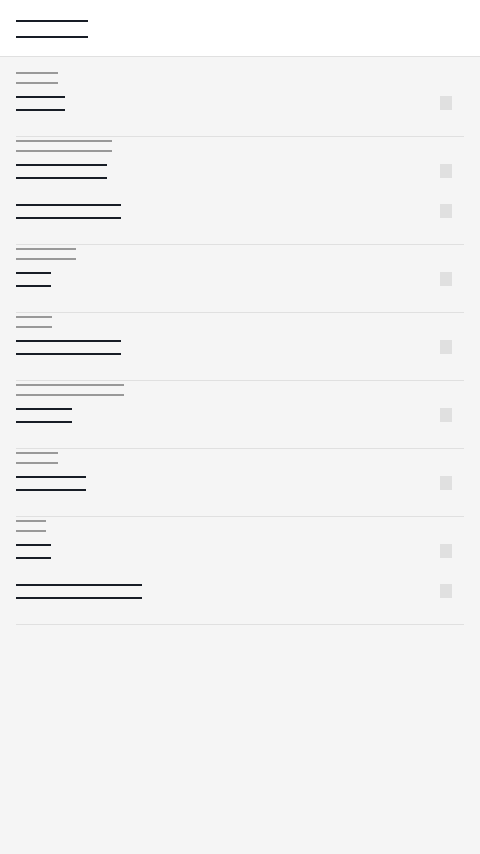

# Maya on the Fly

AI-assisted document creation with multi-agent chat, Git version control, and multi-format export.

Built with Flutter 3.44.4 — runs on Android, iOS, macOS, and web.

## Features

- **Document Editor** — Markdown editor with live preview, word/char count, and unsaved-changes protection
- **Multi-Agent Chat** — 13 specialized AI agents (Writer, Coder, Researcher, Tutor, Planner, Debugger, DevOps, and more) with auto-routing
- **Chain of Truth** — Structured reasoning projects with evidence chains (coming in a future update)
- **Git Integration** — Stage, commit, diff, branch management, remote sync
- **Multi-Format Export** — Export documents to TXT, HTML, PDF, and DOCX with share support
- **Settings & Security** — Profile management, AI model configuration, usage dashboard, app lock with biometric auth, theme customization
- **Offline-First** — Local SQLite database with AES-256 encryption via sqlcipher
- **Onboarding Flow** — Guided introduction to all features

## Screenshots

| Home | Document Editor | Chat | Settings |
|------|----------------|------|----------|
|  |  |  |  |

## Getting Started

### Prerequisites

- Flutter SDK 3.44.4 ([install guide](https://docs.flutter.dev/get-started/install))
- Dart SDK 3.7+

### Setup

```bash
git clone https://github.com/bagaswap111/maya-on-the-fly-mobile.git
cd maya-on-the-fly-mobile/maya_on_the_fly
flutter pub get
```

### Run

```bash
flutter run
```

### Test

```bash
flutter test
dart analyze lib/
dart analyze test/
```

## Architecture

```
lib/
├── core/              # Router, theme, app bootstrap
├── design/            # Design tokens, spacing, colors
├── features/          # Feature modules
│   ├── agent/         # AI agent system (engine, tools, registries)
│   ├── ai/            # AI provider abstraction (DeepSeek)
│   ├── chat/          # Multi-agent chat sessions
│   ├── cot/           # Chain of Truth projects
│   ├── documents/     # Document service
│   ├── editor/        # Markdown document editor
│   ├── export/        # Multi-format document export
│   ├── git/           # Git version control UI
│   ├── home/          # Home page with quick actions
│   └── settings/      # Profile, AI config, appearance, privacy
├── shared/            # Shared widgets (shell, not-found page)
└── utils/             # Error handling, secure storage
```

## AI Agents

| Agent | ID | Description |
|-------|----|-------------|
| Auto | `auto` | Routes requests to the best specialist agent |
| Writer | `writer` | Drafts, edits, and refines documents |
| Coder | `coder` | Generates, reviews, and refactors code |
| Editor | `editor` | Proofreads and polishes content |
| Researcher | `researcher` | Gathers and synthesizes information |
| Analyst | `analyst` | Analyzes data and generates insights |
| Tutor | `tutor` | Teaches and explains concepts |
| Translator | `translator` | Translates text between languages |
| Summarizer | `summarizer` | Condenses long content into key points |
| Reviewer | `reviewer` | Reviews code and documents |
| Planner | `planner` | Breaks down tasks and creates plans |
| Debugger | `debugger` | Diagnoses and fixes code issues |
| DevOps | `devops` | Handles infrastructure and deployment |

## Configuration

### API Key

Get a free DeepSeek API key at [platform.deepseek.com](https://platform.deepseek.com) and enter it in **Settings → Model Manager**.

## CI/CD

| Workflow | Trigger | Status |
|----------|---------|--------|
| CI | Push/PR to `main` | `flutter analyze` + `flutter test` |
| Build | Tag `v*` or manual dispatch | APK + IPA artifacts + GitHub Release |

## Tech Stack

- **Framework:** Flutter 3.44.4
- **State:** Riverpod
- **Navigation:** go_router
- **Database:** sqflite + sqlcipher (AES-256)
- **AI Model:** DeepSeek V4 Flash
- **Auth:** local_auth (biometric), flutter_secure_storage
- **Git:** git2dart
