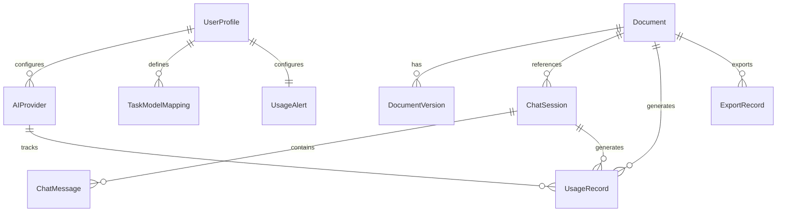

# Maya on the Fly — Architecture

## Table of Contents

1. [System Overview & Technical Stack](#1-system-overview--technical-stack)
2. [SRS — Software Requirements Specification (SoT #1)](#2-srs--software-requirements-specification-sot-1)
3. [Information Architecture (SoT #2)](#3-information-architecture-sot-2)
4. [Design System (SoT #3)](#4-design-system-sot-3)
5. [Data Model (SoT #6)](#5-data-model-sot-6)
6. [API Contracts — UCIC (SoT #7)](#6-api-contracts--ucic-sot-7)
7. [Component Architecture](#7-component-architecture)
8. [Security Architecture](#8-security-architecture)
9. [Flutter Implementation Architecture](#9-flutter-implementation-architecture)
10. [Traceability Matrix](#10-traceability-matrix)

---

## 1. System Overview & Technical Stack

### 1.1 Product Summary

Maya on the Fly is a Flutter-native mobile application for AI-assisted document creation. It provides a Markdown editor with live preview, multi-agent AI chat for writing/research/code, Git version control, and multi-format export — all running on-device with direct HTTP calls to cloud AI APIs. No server-side logic, no embedded runtimes.

### 1.2 Target Users

| Role | Description | Key Goals |
|------|-------------|-----------|
| **Researcher** | Academic writers, PhD students, postdocs | Write papers, manage citations, collaborate on drafts |
| **Student** | University students across disciplines | Take notes, write essays, research papers |
| **Programmer** | Software developers | Write docs, README, API specs, code with AI |
| **Business Owner** | Founders, managers, consultants | Write proposals, reports, business plans, executive summaries |

### 1.3 Technical Stack

| Layer | Technology | Rationale |
|-------|------------|-----------|
| Framework | Flutter 3.x (Dart 3.x) | Single codebase, native perf on Android & iOS |
| State Management | Riverpod 2.x | Type-safe, testable, minimal boilerplate |
| Local Storage | drift (SQLite) + path_provider | Persistent usage data, file storage |
| Secure Storage | flutter_secure_storage | API keys, PATs in OS keychain |
| AI API | OpenAI-compatible HTTP (SSE streaming) | DeepSeek, OpenAI, Anthropic, OpenRouter |
| Git | git2dart (libgit2 FFI) | Native git on Android + iOS |
| Markdown | super_editor + flutter_markdown | Rich editing + live preview |
| PDF Export | pdf or printing package | Server-less PDF generation |
| DOCX Export | Custom Dart module | Markdown AST -> OpenXML |
| Charts | fl_chart | Usage dashboard visualizations |
| OAuth | google_sign_in + flutter_appauth | Google Drive, GitHub |
| Fonts | google_fonts (Inter) + system-ui fallback | Open-source, no licensing risk |

### 1.4 Operating Environment

- **Minimum OS:** Android 8.0 (API 26), iOS 15.0
- **Target OS:** Android 14+, iOS 17+
- **Form Factors:** Phones (360-428dp width), Tablets (600-1024dp)
- **Connectivity:** Internet required for AI features. Editor and git work offline (sync on reconnect).
- **Storage:** App sandboxed document directory. ~50MB baseline, expands with user documents.

### 1.5 Constraints

| ID | Constraint | Impact |
|----|-----------|--------|
| C001 | No server-side hosting — everything on-device or direct-to-API | No backend to maintain; all AI calls are client-side HTTP |
| C002 | iOS blocks Process.start() — no shell/CLI spawning | Git must use libgit2 FFI (git2dart), not git CLI |
| C003 | API keys stored in OS keychain only | flutter_secure_storage; never in plaintext |
| C004 | All AI features require internet | Graceful degradation: editor/git work offline, AI shows clear error |
| C005 | Font licensing — no commercial fonts without license | Use Inter (OFL) as primary, system-ui fallback |

### 1.6 Assumptions

- Users have an active internet connection for AI features
- DeepSeek V4 Flash API remains available at api.deepseek.com
- 5M free tokens per new DeepSeek account is sufficient for evaluation
- Users have basic familiarity with Markdown, Git, and AI chat interfaces
- iPad users may have hardware keyboards

---

## 2. SRS — Software Requirements Specification (SoT #1)

### 2.1 Product Overview

Maya on the Fly replaces prompt-driven AI development with Source-of-Truth-driven document creation. It provides a structured environment where users write Markdown documents with AI assistance, manage versions with Git, and export to multiple formats — all from a mobile device.

### 2.2 Business Goals

| ID | Goal | Metric |
|----|------|--------|
| BG1 | Enable document creation entirely on mobile | User can write + export a complete document without a desktop |
| BG2 | Reduce AI token costs through smart routing | Average cost per session < $0.05 (Free mode) |
| BG3 | Support academic writing workflows | Citation management, bibliography generation, LaTeX |
| BG4 | Provide professional-grade Git on mobile | Push/pull/clone/diff/merge conflict resolution |
| BG5 | Democratize AI writing tools | Free mode with all features unlocked |

### 2.3 System Features

#### F001: AI Chat with Streaming (Priority: High)

**Description:** Real-time conversational AI interface with token-by-token streaming. Supports multiple AI providers and model switching per task.

**Functional Requirements:**
- FR-001.1: System MUST stream AI responses token-by-token via SSE for real-time display
- FR-001.2: System MUST support conversation history within a session (message list)
- FR-001.3: System MUST allow context injection from the current open document
- FR-001.4: System MUST display a typing indicator when AI is generating
- FR-001.5: System MUST support stop/cancel of in-progress AI generation
- FR-001.6: System MUST surface the detected task type (chat/write/academic/etc.) as a UI badge
- FR-001.7: System MUST show active agent name and available tools in the chat header
- FR-001.8: System MUST display session token count in real-time in the chat header

**Business Rules:**
- BR-001.1: Free mode uses a single configured model for all tasks
- BR-001.2: Custom mode routes tasks per the user's model mapping table
- BR-001.3: Token usage is tracked per-session, per-model, and per-task
- BR-001.4: Hard cap stops all AI calls when reached; user must manually reset

**Acceptance Criteria:**
- [ ] User sends message and sees tokens appear character by character
- [ ] User can stop generation mid-stream
- [ ] Task type badge accurately reflects the detected intent
- [ ] Stop button is visible and functional during active generation

#### F002: Multi-Agent System (Priority: High)

**Description:** 13 agent personas (Writer, Academic Writer, Business Writer, Technical Writer, Coder, Editor, Humanizer, Researcher, Reviewer, Formatter, Data Analyst, Collaborator, Auto) with per-agent tool sets and model routing.

**Functional Requirements:**
- FR-002.1: System MUST provide all 13 agent personas as selectable options
- FR-002.2: Each agent MUST have a defined tool set and suggested model tier
- FR-002.3: Auto agent MUST route to the best agent based on task content detection
- FR-002.4: System MUST allow agent switching mid-conversation
- FR-002.5: System MUST surface the current agent's available tools in the chat header UI

**Business Rules:**
- BR-002.1: Free mode unlocks all agents — no feature gating
- BR-002.2: Custom mode allows per-agent model mapping and agent restriction per profile

**Acceptance Criteria:**
- [ ] User can switch between all 13 agents
- [ ] Each agent exhibits different tool availability and behavior
- [ ] Auto agent correctly routes at least 3 distinct task types
- [ ] Tool indicator in chat header matches the selected agent

#### F003: Task Router (Priority: High)

**Description:** Automated classification of user requests into task types (chat, write, academic, business, code, review, edit, humanize, research, commit, plan, format, search) for optimal agent and model selection.

**Functional Requirements:**
- FR-003.1: System MUST classify user messages into one of 13 task types
- FR-003.2: System MUST display the detected task type as a UI badge
- FR-003.3: System MUST route to the configured model per task type in Custom mode
- FR-003.4: System MUST fall back to the default model if task type is unrecognized
- FR-003.5: Tapping the task badge MUST show the full task-type mapping table

**Acceptance Criteria:**
- [ ] "write a research proposal" triggers "academic" task type
- [ ] "fix this bug" triggers "code" or "review" task type
- [ ] "make this sound less robotic" triggers "humanize" task type
- [ ] Unrecognized input falls back gracefully

#### F004: Agent Loop & Tool Execution (Priority: High)

**Description:** Multi-turn agent execution cycle where the model can request tool calls, results are executed in Dart, and fed back for continued reasoning.

**Functional Requirements:**
- FR-004.1: System MUST support multi-turn agent loop (model -> tool call -> execute -> result -> model -> ...)
- FR-004.2: System MUST execute tool calls locally in Dart (no external process)
- FR-004.3: System MUST support OpenAI-compatible function calling format
- FR-004.4: System MUST display a prominent Stop button during active agent loop
- FR-004.5: Stop MUST cancel the current API call and discard pending tool results
- FR-004.6: Stop MUST return partial output generated so far

**Business Rules:**
- BR-004.1: Destructive tools (write_file, run_terminal) default to "confirm" approval level
- BR-004.2: Read-only tools (read_file, search_code) default to "auto" approval level

**Acceptance Criteria:**
- [ ] Agent completes a multi-turn task (e.g., read file -> edit -> commit)
- [ ] Stop button interrupts mid-loop and returns partial output
- [ ] Destructive tool requires user confirmation before execution

#### F005: Markdown Editor (Priority: High)

**Description:** Rich Markdown document editor with live preview, auto-save, and LaTeX math rendering.

**Functional Requirements:**
- FR-005.1: System MUST provide rich-text Markdown editing via super_editor
- FR-005.2: System MUST render live preview via flutter_markdown
- FR-005.3: System MUST support LaTeX math rendering ($...$ and $$...$$)
- FR-005.4: System MUST auto-save to local storage every 5 seconds
- FR-005.5: System MUST support side-by-side edit/preview on tablet
- FR-005.6: System MUST support toggleable preview overlay on phone
- FR-005.7: System MUST show a "Discard changes?" confirmation when reverting auto-saved files
- FR-005.8: System MUST show recent documents list on home screen (last 20, sorted by timestamp)
- FR-005.9: System MUST support iPad hardware keyboard shortcuts (Cmd+S, Cmd+E, Cmd+P, Cmd+N, Cmd+Enter, Esc)

**Acceptance Criteria:**
- [ ] User can create, edit, and preview a Markdown document
- [ ] LaTeX equations render correctly in preview
- [ ] Auto-save persists content within 5 seconds of change
- [ ] Discard confirmation prevents accidental data loss
- [ ] Recent documents list shows accurate timestamps and previews

#### F006: Git Version Control (Priority: High)

**Description:** Full Git integration via git2dart for init, clone, add, commit, push, pull, diff, log operations with biometric security.

**Functional Requirements:**
- FR-006.1: System MUST support git init, clone, add, commit, push, pull, diff, log
- FR-006.2: System MUST support GitHub OAuth and PAT authentication
- FR-006.3: System MUST require biometric gate (FaceID/fingerprint) before push operations
- FR-006.4: System MUST provide conflict resolution UI during merge conflicts
- FR-006.5: System MUST poll git status while app is foregrounded
- FR-006.6: System MUST auto-stage files on save (git add)
- FR-006.7: System MUST show progress indicators for clone (phased), push, and pull
- FR-006.8: System MUST show inline diff viewer for unstaged changes

**Business Rules:**
- BR-006.1: PAT stored in flutter_secure_storage, never in plaintext
- BR-006.2: Push requires biometric authentication every time
- BR-006.3: Clone defaults to app's sandbox document directory

**Acceptance Criteria:**
- [ ] User can clone a repository and see files in the editor
- [ ] User can commit with a message bottom sheet
- [ ] Push triggers biometric gate and shows progress
- [ ] Merge conflicts show resolution UI

#### F007: Export Engine (Priority: High)

**Description:** Convert Markdown documents to HTML, PDF, DOCX, and plain text, with multiple export destinations.

**Functional Requirements:**
- FR-007.1: System MUST export to HTML, PDF, DOCX, and plain text
- FR-007.2: System MUST support export destinations: local save, system share, iCloud Drive, Google Drive
- FR-007.3: System MUST run conversion in a Dart Isolate for non-blocking UI
- FR-007.4: System MUST show a progress bar during conversion with phase labels
- FR-007.5: System MUST provide Back and Cancel buttons at every export step
- FR-007.6: System MUST disable the Export button after first tap (prevent double-submit)
- FR-007.7: System MUST re-enable Export on failure so user can retry

**Acceptance Criteria:**
- [ ] Export produces valid PDF/HTML/DOCX/TXT from a Markdown file
- [ ] Progress bar shows during conversion
- [ ] Back/Cancel works at every step without side effects
- [ ] Double-tap Export only triggers one conversion

#### F008: Model Manager (Priority: Medium)

**Description:** Central configuration for AI providers with Free/Custom mode toggle, per-task model routing, API key management, and usage tracking.

**Functional Requirements:**
- FR-008.1: System MUST provide Free/Custom mode toggle in settings
- FR-008.2: Free mode MUST offer a curated list of free models with a single picker
- FR-008.3: Custom mode MUST allow per-task and per-agent model assignment
- FR-008.4: System MUST store API keys in flutter_secure_storage
- FR-008.5: System MUST track token usage per session, per model, per task
- FR-008.6: System MUST provide configurable usage alerts and hard cap
- FR-008.7: System MUST show usage dashboard with per-model and per-task breakdowns
- FR-008.8: System MUST persist usage data in local SQLite (drift)

**Acceptance Criteria:**
- [ ] Toggle between Free and Custom modes updates available options
- [ ] API keys are stored securely and never displayed in plaintext
- [ ] Hard cap stops AI calls and shows clear message
- [ ] Usage dashboard shows accurate token counts and cost estimates

#### F009: Skills System (Priority: Medium)

**Description:** 46 tool functions across 8 categories (File, Search, Agent/Infrastructure, Research, Git, Document Structure, Writing Quality, Humanizer) with approval levels.

**Functional Requirements:**
- FR-009.1: System MUST support 46 tool functions organized in 8 categories
- FR-009.2: Each skill MUST have an approval level (auto/notify/confirm)
- FR-009.3: Destructive skills MUST default to "confirm" requiring user tap
- FR-009.4: Humanizer skills MUST support AI detection via local heuristics + API (GPTZero, Originality.ai, Copyleaks)
- FR-009.5: Research skills MUST support literature search via Semantic Scholar, arXiv, CrossRef

**Acceptance Criteria:**
- [ ] All 46 skills are callable by the agent loop
- [ ] Approval levels gate the appropriate skills
- [ ] AI detection returns a score with flagged patterns

#### F010: Chain of Truth Workflow Integration (Priority: Medium)

**Description:** Built-in support for the Chain of Truth 7-phase development methodology, with templates and artifact management.

**Functional Requirements:**
- FR-010.1: System MUST include templates for SRS, IA, Design System, User Flows, Data Model, UCIC, Test Plan, Test Cases
- FR-010.2: System MUST support artifact creation and editing within the Markdown editor
- FR-010.3: System MUST provide index.md registries for user_flows/ and system_logics/ directories
- FR-010.4: System MUST support traceability links between artifacts

**Acceptance Criteria:**
- [ ] User can create a new CoT project from templates
- [ ] Artifacts are organized per the CoT docs/ layout

### 2.4 Feature Inventory

| Feature ID | Feature Name | Priority | Dependencies | Status |
|------------|--------------|----------|--------------|--------|
| F001 | AI Chat with Streaming | High | — | Planned |
| F002 | Multi-Agent System | High | F001 | Planned |
| F003 | Task Router | High | F001 | Planned |
| F004 | Agent Loop & Tool Execution | High | F001, F002, F003 | Planned |
| F005 | Markdown Editor | High | — | Planned |
| F006 | Git Version Control | High | — | Planned |
| F007 | Export Engine | High | F005 | Planned |
| F008 | Model Manager | Medium | F001 | Planned |
| F009 | Skills System | Medium | F004 | Planned |
| F010 | CoT Workflow Integration | Medium | F005 | Planned |

### 2.5 Non-Functional Requirements

#### NFR-001: Performance
- NFR-001.1: App cold start < 3 seconds on target devices
- NFR-001.2: Markdown editor responsive at < 16ms frame time
- NFR-001.3: AI response first token < 2 seconds from send
- NFR-001.4: Export conversion for 1000-line document < 5 seconds
- NFR-001.5: Git operations for typical repo (< 100MB) < 10 seconds

#### NFR-002: Security
- NFR-002.1: API keys stored in OS keychain only (flutter_secure_storage)
- NFR-002.2: Biometric gate required for git push
- NFR-002.3: No plaintext secrets in logs, error messages, or network traces
- NFR-002.4: AI provider communication over HTTPS only
- NFR-002.5: Session tokens never persisted to disk

#### NFR-003: Reliability
- NFR-003.1: Editor functions fully offline (no AI dependency)
- NFR-003.2: Auto-save prevents data loss on crash (max 5s data loss window)
- NFR-003.3: Graceful degradation when AI provider is unreachable
- NFR-003.4: Export retries on transient failure (3 attempts)

#### NFR-004: Usability
- NFR-004.1: New user can create and export a document within 5 minutes
- NFR-004.2: All loading states show indicators (never blank screen)
- NFR-004.3: Empty states show guidance with CTA
- NFR-004.4: Error messages in plain language with actionable fixes
- NFR-004.5: Touch targets minimum 44dp (WCAG AAA)

#### NFR-005: Maintainability
- NFR-005.1: Feature-vertical directory structure (feature/ contains all layers)
- NFR-005.2: All AI provider logic behind Provider abstraction
- NFR-005.3: All git operations behind GitRepository abstraction
- NFR-005.4: All skill implementations behind SkillExecutor abstraction

### 2.6 Permissions and Access Control

| Role | Documents | Git | AI | Settings |
|------|-----------|-----|----|----------|
| Owner (device user) | Full CRUD | Full (push requires biometric) | Full with hard cap | Full |

---

## 3. Information Architecture (SoT #2)

### 3.1 Product Modules

| Module | Description | Key Features |
|--------|-------------|--------------|
| Home | Landing screen with recent docs, recent chats, quick actions | F005 |
| Editor | Markdown editing with live preview | F005 |
| Chat | AI conversation interface with agent switching | F001, F002, F003, F004 |
| Git | Repository management, commit, push/pull, diff | F006 |
| Export | Format selection, destination, conversion progress | F007 |
| Settings | Model manager, API keys, profiles, usage dashboard | F008 |
| CoT Studio | Chain of Truth artifact management | F010 |

### 3.2 Module Hierarchy

```
Maya on the Fly
├── Home
│   ├── Recent Documents
│   ├── Recent Chats
│   └── Quick Actions (New Doc, New Chat, Open Repo)
├── Editor
│   ├── Markdown Source
│   └── Live Preview (side-by-side tablet / overlay phone)
├── Chat
│   ├── Conversation Thread
│   ├── Agent Selector (with tool indicator)
│   ├── Task Type Badge
│   ├── Stop Button (during active generation)
│   └── Session Token Counter
├── Git
│   ├── Repository List
│   ├── Status View
│   ├── Diff Viewer
│   ├── Commit Sheet
│   ├── Push/Pull with Progress
│   ├── Clone Flow
│   └── Conflict Resolution UI
├── Export
│   ├── Format Picker
│   ├── Destination Picker
│   ├── Conversion Progress
│   └── Share Menu
├── Settings
│   ├── Mode Toggle (Free / Custom)
│   ├── Model Selector (Free: single picker, Custom: per-task table)
│   ├── API Key Management
│   ├── Provider Configuration
│   ├── Usage Dashboard
│   ├── Usage Alerts & Hard Cap
│   └── Export / Reset Data
└── CoT Studio
    ├── Project List
    ├── Artifact Editor
    ├── Template Browser
    └── Traceability View
```

### 3.3 Navigation Tree

```
/                           -> Home (recent docs + recent chats)
/doc/new                    -> New document (editor)
/doc/:id                    -> Open document (editor)
/doc/:id/preview            -> Full-screen preview
/chat                       -> Chat list
/chat/new                   -> New chat session
/chat/:id                   -> Chat conversation
/git                        -> Git repository list
/git/:repo                  -> Git status view
/git/:repo/diff             -> Diff viewer
/git/:repo/commit           -> Commit sheet
/git/:repo/conflict         -> Conflict resolution
/export                     -> Export start
/export/:docId/format       -> Format picker
/export/:docId/destination  -> Destination picker
/export/:docId/progress     -> Conversion progress
/settings                   -> Settings root
/settings/ai                -> Model manager
/settings/ai/providers      -> Provider configuration
/settings/ai/keys           -> API key management
/settings/usage             -> Usage dashboard
/settings/usage/alerts      -> Usage alerts config
/settings/about             -> About / version
/cot                        -> CoT project list
/cot/new                    -> New CoT project
/cot/:project               -> CoT project artifacts
/*                          -> 404 page
```

### 3.4 Navigation Type

- **Primary navigation:** Bottom navigation bar (Home, Editor, Chat, Git, Settings) on phone; left sidebar on tablet
- **Secondary navigation:** Tab bars within modules, push navigation for sub-screens
- **Breadcrumbs:** Not used (mobile conventions)
- **Navigation behavior:** Bottom nav persists across all main modules; modals for commit, export pickers

### 3.5 Page Inventory

| Page ID | Page Name | Route | Access | Module |
|---------|-----------|-------|--------|--------|
| PAGE-001 | Home | / | Local | Home |
| PAGE-002 | Document Editor | /doc/:id | Local | Editor |
| PAGE-003 | New Document | /doc/new | Local | Editor |
| PAGE-004 | Full Preview | /doc/:id/preview | Local | Editor |
| PAGE-005 | Chat List | /chat | Local | Chat |
| PAGE-006 | Chat Conversation | /chat/:id | Local | Chat |
| PAGE-007 | New Chat | /chat/new | Local | Chat |
| PAGE-008 | Git Repo List | /git/manage | Local | Git |
| PAGE-009 | Git Status | /git/:repo | Local | Git |
| PAGE-010 | Git Diff | /git/:repo/diff | Local | Git |
| PAGE-011 | Git Commit | /git/:repo/commit | Local | Git |
| PAGE-012 | Git Conflict | /git/:repo/conflict | Local | Git |
| PAGE-013 | Export | /export | Local | Export |
| PAGE-014 | Export Format | /export/:docId/format | Local | Export |
| PAGE-015 | Export Destination | /export/:docId/destination | Local | Export |
| PAGE-016 | Export Progress | /export/:docId/progress | Local | Export |
| PAGE-017 | Settings | /settings | Local | Settings |
| PAGE-018 | Model Manager | /settings/ai | Local | Settings |
| PAGE-019 | Usage Dashboard | /settings/usage | Local | Settings |
| PAGE-020 | CoT Project List | /cot | Local | CoT |
| PAGE-021 | CoT Artifact Editor | /cot/:project | Local | CoT |
| PAGE-022 | 404 | * | Local | System |
| PAGE-023 | Profile | /settings/profile | Local | Settings |
| PAGE-024 | Appearance | /settings/appearance | Local | Settings |
| PAGE-025 | Editor Settings | /settings/editor | Local | Settings |
| PAGE-026 | Privacy & Security | /settings/privacy | Local | Settings |
| PAGE-027 | Keyboard Shortcuts | /settings/shortcuts | Local | Settings |
| PAGE-028 | About | /settings/about | Local | Settings |

### 3.6 Page Definitions

#### PAGE-001: Home
- **Route:** /
- **Access:** Local
- **Purpose:** Landing screen showing recent documents, recent chats, and quick actions
- **Key UI elements:** Document list, chat list, action buttons (New Doc, New Chat, Open Repo)
- **Primary actions:** Tap document to open, tap chat to resume, tap quick action
- **Related use cases:** UC-003, UC-004, UC-005
- **Related features:** F005

#### PAGE-002: Document Editor
- **Route:** /doc/:id
- **Access:** Local
- **Purpose:** Markdown editing with live preview, auto-save
- **Key UI elements:** super_editor text area, preview pane, toolbar, auto-save indicator
- **Primary actions:** Edit text, toggle preview, save, open export
- **Related use cases:** UC-003, UC-004
- **Related features:** F005

#### PAGE-006: Chat Conversation
- **Route:** /chat/:id
- **Access:** Local
- **Purpose:** AI chat with agent selection, task routing, and streaming responses
- **Key UI elements:** Message list, input bar, agent selector, task type badge, stop button, token counter
- **Primary actions:** Send message, switch agent, stop generation, view tools
- **Related use cases:** UC-001, UC-002
- **Related features:** F001, F002, F003, F004

#### PAGE-013: Export
- **Route:** /export
- **Access:** Local
- **Purpose:** Entry point for document export with format and destination selection
- **Key UI elements:** Format picker, destination picker, progress bar, back/cancel
- **Primary actions:** Select format, select destination, start export, cancel
- **Related use cases:** UC-004
- **Related features:** F007

#### PAGE-018: Model Manager
- **Route:** /settings/ai
- **Access:** Local
- **Purpose:** AI provider configuration with Free/Custom mode toggle
- **Key UI elements:** Mode toggle, model picker, per-task mapping table, API key fields
- **Primary actions:** Toggle mode, select models, enter API keys
- **Related use cases:** UC-007
- **Related features:** F008

#### PAGE-019: Usage Dashboard
- **Route:** /settings/usage
- **Access:** Local
- **Purpose:** Token usage tracking, cost estimation, per-model/per-task breakdown
- **Key UI elements:** Session/today/week/month counters, bar charts, alert config
- **Primary actions:** View breakdown, configure alerts, reset counters, export CSV
- **Related use cases:** UC-007
- **Related features:** F008

#### PAGE-003: New Document
- **Route:** /doc/new
- **Access:** Local
- **Purpose:** Create a new document from a template or blank slate
- **Key UI elements:** Template carousel (Blank, Research Paper, Business Proposal, Meeting Notes, Technical Spec), Create button
- **Primary actions:** Select template, create document
- **Related use cases:** UC-003
- **Related features:** F005

#### PAGE-004: Full Preview
- **Route:** /doc/:id/preview
- **Access:** Local
- **Purpose:** Full-screen read-only preview of rendered Markdown with pinch-to-zoom
- **Key UI elements:** InteractiveViewer, flutter_markdown renderer, share/export buttons
- **Primary actions:** Preview, share, export
- **Related use cases:** UC-003
- **Related features:** F005

#### PAGE-005: Chat List
- **Route:** /chat
- **Access:** Local
- **Purpose:** List of recent AI chat sessions
- **Key UI elements:** ChatSessionItem (agent avatar, title, timestamp, token badge), new chat button, empty state
- **Primary actions:** Tap to resume chat, create new chat
- **Related use cases:** UC-001
- **Related features:** F001

#### PAGE-007: New Chat
- **Route:** /chat/new
- **Access:** Local
- **Purpose:** Create a new chat session with agent selection
- **Key UI elements:** AgentGrid (13 agent cards with avatar, name, description, tool count), quick prompt chips
- **Primary actions:** Select agent, start chat
- **Related use cases:** UC-001
- **Related features:** F001, F002

#### PAGE-008: Git Repo List
- **Route:** /git
- **Access:** Local
- **Purpose:** List of Git repositories in app sandbox
- **Key UI elements:** RepoListItem (name, path, branch, unpushed badge), init/clone buttons
- **Primary actions:** Open repo, init new, clone remote
- **Related use cases:** UC-005
- **Related features:** F006

#### PAGE-009: Git Status
- **Route:** /git/:repo (default view when Git tab opened with existing repos)
- **Access:** Local
- **Purpose:** Repository status showing changed files with staging and commit
- **Key UI elements:** RepoSwitcherDropdown (title area), branch chip, remote info, FileStatusItem list with stage checkboxes, commit button, push/pull buttons
- **Primary actions:** Switch repo via dropdown, stage/unstage, commit, push, pull, manage repos
- **Related use cases:** UC-005
- **Related features:** F006

#### PAGE-010: Git Diff
- **Route:** /git/:repo/diff
- **Access:** Local
- **Purpose:** Side-by-side or unified diff viewer for changed files
- **Key UI elements:** DiffSummaryBar (additions/deletions, unified/split toggle), DiffHunk list with line numbers and gutter indicators
- **Primary actions:** View diff, stage/unstage from diff view
- **Related use cases:** UC-005
- **Related features:** F006

#### PAGE-011: Git Commit
- **Route:** /git/:repo/commit
- **Access:** Local
- **Purpose:** Commit staged changes with message
- **Key UI elements:** Commit message field, staged file list, diff preview, conventional commit chips (feat/fix/docs)
- **Primary actions:** Enter message, commit
- **Related use cases:** UC-005
- **Related features:** F006

#### PAGE-012: Git Conflict
- **Route:** /git/:repo/conflict
- **Access:** Local
- **Purpose:** Merge conflict resolution interface
- **Key UI elements:** ConflictFileCard (ours/theirs code snippets), AcceptOurs/AcceptTheirs/EditManually buttons
- **Primary actions:** Resolve conflicts, mark resolved
- **Related use cases:** UC-005
- **Related features:** F006

#### PAGE-014: Export Format
- **Route:** /export/:docId/format
- **Access:** Local
- **Purpose:** Select output format for document export
- **Key UI elements:** FormatPicker grid (PDF, HTML, DOCX, TXT) with selected state overlay
- **Primary actions:** Select format, proceed to destination
- **Related use cases:** UC-004
- **Related features:** F007

#### PAGE-015: Export Destination
- **Route:** /export/:docId/destination
- **Access:** Local
- **Purpose:** Select destination for exported file
- **Key UI elements:** DestinationPicker grid (Local, Share, iCloud, Google Drive)
- **Primary actions:** Select destination, start export
- **Related use cases:** UC-004
- **Related features:** F007

#### PAGE-016: Export Progress
- **Route:** /export/:docId/progress
- **Access:** Local
- **Purpose:** Show export conversion progress
- **Key UI elements:** Progress bar with phase labels, cancel button, completion animation
- **Primary actions:** Cancel export, view completion
- **Related use cases:** UC-004
- **Related features:** F007

#### PAGE-017: Settings
- **Route:** /settings
- **Access:** Local
- **Purpose:** Main settings hub with sectioned list
- **Key UI elements:** ListTile groups (Profile, AI Configuration, Appearance, Editor, Privacy, About)
- **Primary actions:** Navigate to sub-settings pages
- **Related use cases:** UC-007
- **Related features:** F008

#### PAGE-020: CoT Project List
- **Route:** /cot
- **Access:** Local
- **Purpose:** List of Chain of Truth projects
- **Key UI elements:** CotProjectCard (name, artifact count, status badge), new project button
- **Primary actions:** Open project, create new
- **Related use cases:** UC-003
- **Related features:** F010

#### PAGE-021: CoT Artifact Editor
- **Route:** /cot/:project
- **Access:** Local
- **Purpose:** Edit Chain of Truth artifacts with tree navigation and template support
- **Key UI elements:** Artifact tree panel, Markdown editor, template selector, generate button
- **Primary actions:** Navigate artifacts, edit content, generate from template
- **Related use cases:** UC-003
- **Related features:** F010

#### PAGE-022: 404
- **Route:** *
- **Access:** Local
- **Purpose:** Catch-all not-found page
- **Key UI elements:** Question mark icon, "Page Not Found" message, "Go Home" link
- **Primary actions:** Navigate home

#### PAGE-023: Profile
- **Route:** /settings/profile
- **Access:** Local
- **Purpose:** User profile details (name, default author info)
- **Key UI elements:** Text fields for name, email, default signature
- **Primary actions:** Edit and save profile
- **Related use cases:** UC-007
- **Related features:** F008

#### PAGE-024: Appearance
- **Route:** /settings/appearance
- **Access:** Local
- **Purpose:** Theme selection (light/dark/system), font size, code block theme
- **Key UI elements:** Theme picker, font size slider, code theme selector
- **Primary actions:** Select theme, adjust font
- **Related use cases:** UC-007
- **Related features:** NFR-004

#### PAGE-025: Editor Settings
- **Route:** /settings/editor
- **Access:** Local
- **Purpose:** Editor preferences (spell check, line numbers, tab size, export defaults)
- **Key UI elements:** Switches, segmented controls, format/destination picker for defaults
- **Primary actions:** Toggle settings, set export defaults
- **Related use cases:** UC-007
- **Related features:** F005

#### PAGE-026: Privacy & Security
- **Route:** /settings/privacy
- **Access:** Local
- **Purpose:** App lock, auto-lock timer, data management
- **Key UI elements:** Biometric/PIN toggle, auto-lock timer picker, clear cache button
- **Primary actions:** Enable auth, clear cache
- **Related use cases:** UC-007
- **Related features:** NFR-003

#### PAGE-027: Keyboard Shortcuts
- **Route:** /settings/shortcuts
- **Access:** Local
- **Purpose:** iPad keyboard shortcut configuration
- **Key UI elements:** Shortcut list with key combination display
- **Primary actions:** View and customize shortcuts
- **Related use cases:** UC-007
- **Related features:** F005 (iPad support)

#### PAGE-028: About
- **Route:** /settings/about
- **Access:** Local
- **Purpose:** App version, licenses, changelog
- **Key UI elements:** Version string, license list, changelog
- **Primary actions:** View licenses, check version
- **Related use cases:** UC-007

### 3.7 User Navigation Flows

| From Page | To Page | Trigger | Notes |
|-----------|---------|---------|-------|
| PAGE-001 | PAGE-002 | Tap recent document | Opens document in editor |
| PAGE-001 | PAGE-006 | Tap recent chat | Restores chat history |
| PAGE-001 | PAGE-005 | Tap "See All" on chats section | Opens full chat list |
| PAGE-001 | PAGE-003 | Tap "New Doc" quick action | Creates blank document |
| PAGE-005 | PAGE-006 | Tap chat session | Opens conversation |
| PAGE-005 | PAGE-007 | Tap new chat button | Creates new session |
| PAGE-001 | PAGE-007 | Tap "New Chat" quick action | Starts new session |
| PAGE-001 | PAGE-009 | Tap "Open Repo" (if last repo exists) | Opens status of last-opened repo |
| PAGE-001 | PAGE-008 | Tap "Open Repo" (no repos yet) | Opens empty repo list to init/clone |
| PAGE-002 | PAGE-013 | Tap export button | Opens export flow |
| PAGE-006 | PAGE-003 | Tap "New Doc" from context | Creates doc from chat |
| PAGE-008 | PAGE-009 | Tap repository | Switch active repo, open status |
| PAGE-009 | PAGE-008 | Tap "Manage Repositories" in switcher | Opens full repo list |
| PAGE-009 | PAGE-009 | Select repo from switcher dropdown | Switch repo in-place (no nav push) |
| PAGE-009 | PAGE-010 | Tap file in diff list | Opens diff viewer |
| PAGE-009 | PAGE-011 | Tap commit button | Opens commit sheet |
| PAGE-009 | PAGE-012 | Conflict detected | Opens conflict UI |

### 3.8 Routing Conventions

- **Route pattern:** /[module]/[resource] — kebab-case
- **Default landing:** / (Home)
- **Deep link support:** /doc/:id, /chat/:id
- **Not-found behavior:** Catch-all * -> PAGE-022 (404 page with "Go Home" link)
- **Navigation stack:** Each bottom nav tab maintains its own navigation stack

---

## 4. Design System (SoT #3)

See `DESIGN.md` for the complete design system specification. Key adaptations for Maya on the Fly:

### 4.1 Font Change

| Original (DESIGN.md) | Maya on the Fly |
|----------------------|-----------------|
| Haas Grotesk / Haas Groot Disp | **Inter Display** (open-source, OFL license) for display sizes, **Inter** for body text |

Inter is used universally to avoid commercial font licensing issues while maintaining the clean editorial aesthetic described in DESIGN.md.

### 4.2 Added Components

The following components were added to the DESIGN.md to support the app's interaction patterns:

- `loading-spinner`, `loading-spinner-lg` — AI response waiting indicator
- `skeleton-block`, `skeleton-card` — Document list loading state
- `progress-bar-track`, `progress-bar-fill` — Export and git operation progress
- `empty-state`, `empty-state-action` — "No documents yet" guidance
- `error-state`, `error-state-title`, `error-state-retry` — AI error display
- `error-page-404`, `error-page-404-action` — Route not found
- `text-input-error`, `text-input-success`, `form-error-text`, `form-success-text` — API key form validation

### 4.3 Airtable Patterns Not Applicable

The following Airtable marketing patterns from DESIGN.md are not relevant to the Maya on the Fly app UI:

- `pricing-tier-card`, `pricing-tier-card-featured`, `pricing-comparison-row` — No in-app purchasing
- `hero-band`, `signature-coral-card`, `signature-forest-card`, `hero-card-dark` — No marketing landing pages
- `logo-strip` — No partner logos
- `cta-band-light` — No marketing CTAs
- `pricing-display`, `pricing-section`, `pricing-card-title` typography tokens
- `button-pricing-pill` — Pricing sub-system CTA
- `button-legal` — No cookie consent or legal banners in app
- `articles-card`, `topic-filter-rail`, `articles-vertical-rainbow-stripe-hero` — No blog/articles section

---

## 5. Data Model (SoT #6)

### 5.1 Overview

The data model supports documents, chat conversations, AI provider configuration, usage tracking, and Git operations — all local to the device. There is no server-side database.

### 5.2 Entity-Relationship Diagram



### 5.3 Entity Descriptions

#### ENT-001: Document

*Purpose:* Represents a single Markdown document created or edited by the user.

| Attribute | Type | Constraint | Description |
|-----------|------|------------|-------------|
| id | UUID | PK, NOT NULL | Unique identifier |
| title | String | NOT NULL | Document title (first line or user-set) |
| content | String | NOT NULL | Markdown content |
| filePath | String | NOT NULL, UNIQUE | Path in app sandbox |
| wordCount | Integer | default 0 | Word count for summary display |
| contentPreview | String | default '' | First 200 characters for recent list preview |
| createdAt | DateTime | NOT NULL | Creation timestamp |
| updatedAt | DateTime | NOT NULL | Last modification timestamp |
| lastOpenedAt | DateTime | NOT NULL | Last opened for recent list sorting |
| isPinned | Boolean | default false | Pinned to top of recent list |
| gitRepoId | String? | FK -> Repository.id | Associated git repository |

#### ENT-002: DocumentVersion

*Purpose:* Auto-saved version snapshots for undo/revert.

| Attribute | Type | Constraint | Description |
|-----------|------|------------|-------------|
| id | UUID | PK | Unique identifier |
| documentId | UUID | FK -> Document.id, NOT NULL | Parent document |
| content | String | NOT NULL | Snapshot of markdown content |
| versionNumber | Integer | NOT NULL | Monotonically incrementing version (1-based) |
| savedAt | DateTime | NOT NULL | Snapshot timestamp |
| source | Enum | NOT NULL | auto_save | manual_save | git_commit |

#### ENT-003: ChatSession

*Purpose:* An AI conversation session with message history.

| Attribute | Type | Constraint | Description |
|-----------|------|------------|-------------|
| id | UUID | PK | Unique identifier |
| title | String | NOT NULL | Auto-generated from first message |
| agentId | String | NOT NULL | Active agent ID at session start |
| taskType | String? | | Detected task type |
| tokenCount | Integer | default 0 | Total tokens used in session |
| createdAt | DateTime | NOT NULL | Creation timestamp |
| updatedAt | DateTime | NOT NULL | Last message timestamp |
| documentId | UUID? | FK -> Document.id | Linked document context |

#### ENT-004: ChatMessage

*Purpose:* A single message within a chat session (user or AI).

| Attribute | Type | Constraint | Description |
|-----------|------|------------|-------------|
| id | UUID | PK | Unique identifier |
| sessionId | UUID | FK -> ChatSession.id, NOT NULL | Parent session |
| role | Enum | NOT NULL | user | assistant | system | tool |
| content | String | NOT NULL | Message content (Markdown) |
| toolCalls | JSON? | | Tool call data if role=assistant with tools |
| toolResults | JSON? | | Tool result data if role=tool |
| tokenCount | Integer? | | Tokens for this message |
| createdAt | DateTime | NOT NULL | Message timestamp |

#### ENT-005: AIProvider

*Purpose:* Configuration for an AI provider (API key, base URL, model list).
> **Note:** API key is a logical entity attribute stored in `flutter_secure_storage`; the drift table does **not** contain an `apiKey` column.

| Attribute | Type | Constraint | Description |
|-----------|------|------------|-------------|
| id | String | PK | Provider key (deepseek, openai, anthropic, etc.) |
| name | String | NOT NULL | Display name |
| baseUrl | String | NOT NULL | API endpoint |
| apiKey | String | flutter_secure_storage only | Encrypted API key — NOT a drift column |
| defaultModel | String | NOT NULL | Default model ID |
| isEnabled | Boolean | default true | Provider enabled/disabled |
| models | JSON | NOT NULL | Available models list with pricing |
| createdAt | DateTime | NOT NULL | Configuration created |

#### ENT-006: UsageRecord

*Purpose:* Token usage record for cost tracking.

| Attribute | Type | Constraint | Description |
|-----------|------|------------|-------------|
| id | UUID | PK | Unique identifier |
| providerId | String | NOT NULL | Provider key |
| modelId | String | NOT NULL | Model used |
| taskType | String | NOT NULL | Task type (chat, write, code, etc.) |
| inputTokens | Integer | NOT NULL | Input token count |
| outputTokens | Integer | NOT NULL | Output token count |
| cost | Double | NOT NULL | Estimated USD cost |
| documentId | UUID? | FK -> Document.id | Associated document |
| sessionId | UUID? | FK -> ChatSession.id | Associated session |
| createdAt | DateTime | NOT NULL | Usage timestamp |

#### ENT-007: UserProfile

*Purpose:* User configuration profile with mode, model mappings, and preferences.

| Attribute | Type | Constraint | Description |
|-----------|------|------------|-------------|
| id | String | PK | Profile name (e.g., "Balanced") |
| name | String | NOT NULL | Display name for profile editor |
| email | String? | | User email for export metadata |
| signature | String? | | Default commit signature (e.g., "Alice <alice@example.com>") |
| mode | Enum | NOT NULL | free | custom |
| freeModelId | String? | | Selected model in Free mode |
| defaultAgentId | String | NOT NULL | Default agent (e.g., "auto") |
| maxTokens | Integer | default 8192 | Max tokens per response |
| temperature | Double | default 0.7 | Model temperature |
| fontSize | Integer | default 16 | Editor font size |
| theme | Enum | default 'system' | light | dark | system |
| codeTheme | String | default 'github-dark' | Syntax highlighting theme |
| spellCheck | Boolean | default true | Editor spell check toggle |
| lineNumbers | Boolean | default true | Editor line numbers toggle |
| tabSize | Integer | default 4 | Tab/indent width |
| exportDefaults | JSON? | | Default format + destination for export flow |
| lastRepoId | String? | | FK -> Repository.id — last viewed git repo for tab entry |
| authEnabled | Boolean | default false | App lock toggle |
| createdAt | DateTime | NOT NULL | Profile created |
| updatedAt | DateTime | NOT NULL | Profile last modified |

#### ENT-008: TaskModelMapping

*Purpose:* Per-task model assignment in Custom mode.

| Attribute | Type | Constraint | Description |
|-----------|------|------------|-------------|
| id | UUID | PK | Unique identifier |
| profileId | String | FK -> UserProfile.id, NOT NULL | Parent profile |
| taskType | String | NOT NULL | Task type key |
| modelId | String | NOT NULL | Assigned model ID |
| UNIQUE | (profileId, taskType) | | One mapping per task per profile |

#### ENT-009: UsageAlert

*Purpose:* Configurable thresholds for usage warnings and hard caps.

| Attribute | Type | Constraint | Description |
|-----------|------|------------|-------------|
| id | UUID | PK | Unique identifier |
| profileId | String | FK -> UserProfile.id, NOT NULL | Parent profile |
| type | Enum | NOT NULL | warn | block |
| metric | Enum | NOT NULL | cost | tokens |
| threshold | Double | NOT NULL | Warning/block threshold value |
| period | Enum | NOT NULL | session | day | month |
| isEnabled | Boolean | default true | Alert active/inactive |

#### ENT-010: ExportRecord

*Purpose:* History of document exports.

| Attribute | Type | Constraint | Description |
|-----------|------|------------|-------------|
| id | UUID | PK | Unique identifier |
| documentId | UUID | FK -> Document.id, NOT NULL | Exported document |
| format | Enum | NOT NULL | html | pdf | docx | txt |
| destination | Enum | NOT NULL | local | share | icloud | gdrive |
| fileSize | Integer? | | Output file size in bytes |
| createdAt | DateTime | NOT NULL | Export timestamp |

#### ENT-011: Repository

*Purpose:* Git repository reference for a document workspace.

| Attribute | Type | Constraint | Description |
|-----------|------|------------|-------------|
| id | UUID | PK | Unique identifier |
| name | String | NOT NULL | Repository name |
| remoteUrl | String? | | Remote URL (origin) |
| localPath | String | NOT NULL, UNIQUE | Local filesystem path |
| defaultBranch | String | default "main" | Default branch name |
| lastSyncedAt | DateTime? | | Last successful fetch/push |
| authMethod | Enum? | pat | oauth | SSH auth method |
| unpushedCount | Integer | default 0 | Number of commits ahead of remote |
| lastCommitMessage | String? | | Most recent commit message |
| lastCommitAt | DateTime? | | Timestamp of most recent commit |

### 5.4 Relationships

| Relationship | Type | Cardinality | Description |
|--------------|------|-------------|-------------|
| Document -> DocumentVersion | One-to-Many | 1:N | One document has many version snapshots |
| ChatSession -> ChatMessage | One-to-Many | 1:N | One session has many messages |
| Document -> ChatSession | One-to-Many | 1:N | One document can be referenced by many chats |
| UserProfile -> TaskModelMapping | One-to-Many | 1:N | One profile has many per-task mappings |
| UserProfile -> UsageAlert | One-to-ZeroOrOne | 1:0..1 | One profile has at most one alert config; enforced by unique constraint on UsageAlert.profileId |
| AIProvider -> UsageRecord | One-to-Many | 1:N | One provider generates many usage records |
| Document -> UsageRecord | One-to-Many | 1:N | One document generates usage via AI chat |
| Document -> ExportRecord | One-to-Many | 1:N | One document can have many exports |
| Document -> Repository | Many-to-One | N:1 | Many documents can be in one repo |

### 5.5 Business Rules

- BR-DM-001: Document title extracted from first `# ` line or auto-named "Untitled"
- BR-DM-002: ChatSession title auto-generated by AI from first user message
- BR-DM-003: UsageRecord.cost calculated as: `(inputTokens * inputPrice + outputTokens * outputPrice) / 1_000_000`
- BR-DM-004: Free mode ignores TaskModelMapping — uses freeModelId for all tasks
- BR-DM-005: Hard cap (UsageAlert type=block, metric=cost) prevents ALL AI calls when exceeded
- BR-DM-006: API keys are stored in flutter_secure_storage only, never in drift DB
- BR-DM-007: Usage data retained indefinitely on-device; user can delete via Export Data clear

---

## 6. API Contracts — UCIC (SoT #7)

All AI APIs use the OpenAI-compatible chat completions format. The app acts as a direct HTTP client — no backend proxy.

### 6.1 UC-001: AI Chat Completion

**Endpoint:** `POST {provider.baseUrl}/chat/completions`

**Authentication:**
- **Type:** Bearer Token (API key in Authorization header)
- **Token Location:** Header
- **Required Role:** None (API key scoped by provider)

**Request Headers:**
| Header | Value | Required |
|--------|-------|----------|
| Content-Type | application/json | Yes |
| Authorization | Bearer {apiKey} | Yes |

**Request Payload:**
```json
{
  "model": "deepseek-v4-flash",
  "messages": [
    {"role": "system", "content": "You are a writing assistant."},
    {"role": "user", "content": "Write a research proposal"}
  ],
  "stream": true,
  "max_tokens": 8192,
  "temperature": 0.7,
  "tools": [
    {
      "type": "function",
      "function": {
        "name": "read_file",
        "description": "Read a file from the project",
        "parameters": {
          "type": "object",
          "properties": {
            "path": {"type": "string"}
          },
          "required": ["path"]
        }
      }
    }
  ],
  "tool_choice": "auto"
}
```

| Field | Type | Required | Description | Validation |
|-------|------|----------|-------------|------------|
| model | string | Yes | Model ID for the provider | Must be in provider's model list |
| messages | array | Yes | Conversation messages | At least 1 message |
| messages[].role | enum | Yes | "system" | "user" | "assistant" | "tool" | Valid enum |
| messages[].content | string | Yes | Message content | Max 100000 chars |
| stream | boolean | No | Enable SSE streaming | Default false |
| max_tokens | integer | No | Max response tokens | 1-128000, default 8192 |
| temperature | number | No | Sampling temperature | 0.0-2.0, default 0.7 |
| tools | array | No | Available tool definitions | Max 64 tools |
| tool_choice | string | No | "auto" | "none" | "required" | Default "auto" |

**Response (Non-Streaming) — HTTP 200:**
```json
{
  "id": "chatcmpl-xxx",
  "object": "chat.completion",
  "created": 1234567890,
  "model": "deepseek-v4-flash",
  "choices": [
    {
      "index": 0,
      "message": {
        "role": "assistant",
        "content": "Here is your research proposal...",
        "tool_calls": [
          {
            "id": "call_xxx",
            "type": "function",
            "function": {
              "name": "read_file",
              "arguments": "{\"path\": \"docs/proposal.md\"}"
            }
          }
        ]
      },
      "finish_reason": "tool_calls"
    }
  ],
  "usage": {
    "prompt_tokens": 150,
    "completion_tokens": 50,
    "total_tokens": 200
  }
}
```

**Response (Streaming) — SSE:**
```
data: {"id":"chatcmpl-xxx","object":"chat.completion.chunk","choices":[{"delta":{"role":"assistant"},"index":0}]}

data: {"id":"chatcmpl-xxx","object":"chat.completion.chunk","choices":[{"delta":{"content":"Here"},"index":0}]}

data: {"id":"chatcmpl-xxx","object":"chat.completion.chunk","choices":[{"delta":{"content":" is"},"index":0}]}

data: {"id":"chatcmpl-xxx","object":"chat.completion.chunk","choices":[{"delta":{"content":" your"},"index":0}]}
...
data: [DONE]
```

**Status Codes:**
| Status | Meaning | Condition | Response Body |
|--------|---------|-----------|---------------|
| 200 | OK | Successful completion | Chat completion payload or SSE stream |
| 400 | Bad Request | Invalid parameters | `{"error": {"message": "..."}}` |
| 401 | Unauthorized | Invalid/expired API key | `{"error": {"message": "Invalid API Key"}}` |
| 402 | Payment Required | Insufficient credits | `{"error": {"message": "Insufficient balance"}}` |
| 429 | Rate Limited | Too many requests | `{"error": {"message": "Rate limit exceeded"}}` |
| 500 | Server Error | Provider internal error | `{"error": {"message": "Internal server error"}}` |

**Error Handling (Client-Side):**
| Error Condition | Frontend Behavior |
|-----------------|-------------------|
| Network timeout (>30s) | Show "Connection lost. Retrying..." toast, auto-retry 3x with backoff |
| HTTP 401 | Show "Invalid API key. Check your settings." with link to settings |
| HTTP 402 | Show "Provider credit exhausted. Switch models or top up." |
| HTTP 429 | Show "Rate limited. Waiting..." with countdown timer |
| HTTP 5xx | Show "Provider temporarily unavailable. Try again." with retry button |
| SSE stream interrupted | Show partial output, "Generation interrupted" notice, retry button |

### 6.2 UC-002: Tool Execution (Agent Loop)

**Type:** Client-side only — no HTTP call

**Sequence:**
1. Model response contains `tool_calls` array
2. Dart engine parses each tool call (name + arguments JSON)
3. Tool executor looks up the skill by name in the registered skill registry
4. If skill requires `confirm` approval, show confirmation dialog
5. Execute tool locally in Dart
6. Format result as `{"role": "tool", "tool_call_id": "...", "content": "..."}`
7. Append result message to conversation and re-call API
8. Loop until model responds with `finish_reason: "stop"`

**Error Handling:**
| Error Condition | Behavior |
|-----------------|----------|
| Skill not found | Return error to model: "Tool {name} not available" |
| Tool execution fails | Return error to model with exception message |
| User denies confirmation | Return to model: "User denied tool execution" |
| Stop button pressed | Abort API call, discard pending tool results, show partial output |

### 6.3 UC-003: Document CRUD

**Type:** Client-side only — drift SQLite database + file I/O

**Create Document:**
- Insert row in `documents` table
- Write `content` to `filePath` in app sandbox
- Return Document object

**Read Document:**
- Query `documents` table by id
- Read file content from `filePath`
- Return Document with content

**Update Document:**
- Save snapshot to `document_versions` table (for undo)
- Update `documents` table row (content, updatedAt)
- Write updated content to `filePath`
- If in git repo, auto-stage (git add)

**Delete Document:**
- Confirm via dialog
- Delete file from sandbox
- Delete from `documents` table
- Delete related `document_versions`, `usage_records`, `export_records`

### 6.4 UC-004: Document Export

**Type:** Client-side — Dart Isolate conversion

**Sequence:**
1. User selects format (PDF/HTML/DOCX/TXT)
2. User selects destination (local/share/cloud)
3. Backend button disabled, shows "Converting..."
4. Dart Isolate spawned with document content + format
5. Isolate sends progress updates via SendPort:
   - "Parsing Markdown..." (0%)
   - "Building layout..." (25%)
   - "Rendering pages..." (50-90%)
   - "Done." (100%)
6. Result sent back to main isolate
7. For local: save to app sandbox with filename
8. For share: open platform share menu
9. For cloud: upload via respective API
10. Export button re-enabled
11. ExportRecord saved to database

**Supported Provider API Contracts (Model List):**

**DeepSeek:**
- Base URL: `https://api.deepseek.com`
- Models: `deepseek-v4-flash`, `deepseek-v4-pro`
- Pricing: Flash $0.14/$0.28 per 1M tokens (I/O), Pro $0.28/$0.56 per 1M tokens

**OpenAI-compatible (OpenRouter, etc.):**
- Base URL: configurable
- Models: any supported by the provider
- Auth: Bearer token

### 6.5 UC-005: Git Operations

**Type:** Client-side — git2dart FFI

**Clone:**
- `git2dart.Clone(url, localPath, credentials)`
- Progress callback: "Connecting..." -> "Downloading objects (XX%)" -> "Checking out files..." -> "Done."

**Commit:**
- `index.addAll()` (all modified files)
- `index.write()` -> `repository.commit(message)`
- Show bottom sheet for commit message input

**Push:**
- Trigger biometric gate (FaceID/TouchID)
- On success: `remote.push(credentials, refspecs)`
- On biometric failure: show "Authentication required" message

**Pull:**
- `remote.fetch(credentials)` with progress
- `repository.merge(targetCommit)`
- If conflict: open conflict resolution UI

**Conflict Resolution:**
- Show files with conflicts
- For each file: show "ours" vs "theirs" diff
- User selects resolution per conflict: Accept Ours / Accept Theirs / Edit Manually
- After all resolved: `index.addAll()` -> commit merge

### 6.6 UC-006: Usage Tracking

**Type:** Client-side — in-memory Riverpod state + drift persistence

**Session Tracking:**
- On each API response, extract `usage.prompt_tokens` and `usage.completion_tokens`
- Update in-memory session counters (Riverpod state)
- Display in chat header

**Persistent Tracking:**
- After each API call, insert `UsageRecord` into drift DB
- Aggregate by day/week/month for dashboard

**Alert Checking:**
- After each API call, check `UsageAlert` thresholds
- If warn threshold exceeded: show non-blocking warning banner
- If block threshold exceeded: prevent further AI calls, show blocking message

### 6.7 UC-007: Settings & Profile Management

**Description:** Configure user preferences, manage AI providers, and control app behavior through Settings pages.

**Operations:**

| Operation | Method | Description |
|-----------|--------|-------------|
| Get User Profile | Read (Drift) | Load UserProfile from local DB |
| Update User Profile | Write (Drift) | Save profile changes (theme, font, editor prefs) |
| Toggle Mode | Write (Drift) | Switch between Free and Custom modes |
| Update Model Mapping | Write (Drift) | Change per-task model assignments |
| Validate API Key | POST + Read | Send test request to provider, persist on success |
| Update Alerts | Write (Drift) | Modify UsageAlert thresholds |
| Clear Export Cache | Delete (Filesystem) | Remove cached export files |
| Toggle Auth | Write (Secure Storage) | Enable/disable biometric or PIN auth |
| Export Usage Data | Read + Generate | Query UsageRecords, generate CSV |

**Data Flow:**

```
User → SettingsPage → ProfileService → Drift (UserProfile, AIProvider, TaskModelMapping, UsageAlert)
```

**Error Handling:**
- Database read failure: restore defaults, show recovery message
- API key validation failure: show inline error on field, do NOT persist
- Biometric not enrolled: fallback to PIN, show setup instructions

---

## 7. Component Architecture

### 7.1 Flutter Widget Tree (High-Level)

```
MaterialApp (GoRouter)
├── HomePage
│   ├── RecentDocumentsList
│   │   ├── DocumentListItem (tap -> EditorPage)
│   │   └── EmptyStateWidget
│   └── RecentChatsSection
│       ├── ChatSessionItem (tap -> ChatPage)
│       └── QuickActions (New Doc, New Chat, Open Repo)
├── EditorPage
│   ├── EditorToolbar (save indicator, preview toggle, export)
│   ├── MarkdownEditor (super_editor)
│   └── PreviewPane (flutter_markdown, overlay on phone/side on tablet)
├── ChatPage
│   ├── ChatHeader (agent selector, task badge, stop button, token counter)
│   ├── MessageList
│   │   ├── UserMessage
│   │   ├── AssistantMessage (streaming text + tool calls)
│   │   └── ToolResultMessage
│   └── ChatInputBar (text field, send button, context indicator)
├── GitPage
│   ├── RepoList
│   │   └── RepoListItem
│   ├── StatusView (changed files list)
│   │   └── FileStatusItem (tap -> DiffViewer)
│   ├── CommitSheet (message input, diff summary)
│   ├── PushPullProgress (progress bar, phase label)
│   ├── CloneFlow (URL input, progress, credential prompt)
│   └── ConflictResolutionUI (ours/theirs toggle per conflict)
├── ExportPage
│   ├── FormatPicker (card grid: PDF, HTML, DOCX, TXT)
│   ├── DestinationPicker (local, share, iCloud, Google Drive)
│   ├── ConversionProgress (progress bar, phase label, cancel)
│   └── ShareSheet (platform share menu)
├── SettingsPage
│   ├── ModeToggle (Free/Custom switch)
│   ├── ModelPicker (free mode) / TaskMappingTable (custom mode)
│   ├── ApiKeyManager (add/edit/delete providers)
│   ├── UsageDashboard (counters, bar charts)
│   │   ├── SessionCounter
│   │   ├── PerModelBreakdown (fl_chart)
│   │   └── PerTaskBreakdown (fl_chart)
│   └── AlertConfig (threshold sliders, enable toggles)
├── CotStudioPage
│   ├── ProjectList
│   ├── ArtifactEditor (utilizes MarkdownEditor)
│   └── TemplateBrowser
└── NotFoundPage (404 with "Go Home" link)
```

### 7.2 Dart Service Layer

```
lib/
├── main.dart                          # App entry, provider scope
├── app.dart                           # MaterialApp.router, GoRouter
├── core/
│   ├── router.dart                    # GoRouter route definitions
│   ├── theme.dart                     # ThemeData from DESIGN.md tokens
│   ├── constants.dart                 # App-wide constants
│   └── extensions/                    # Dart extension methods
├── features/
│   ├── home/
│   │   ├── presentation/
│   │   │   ├── home_page.dart
│   │   │   └── widgets/
│   │   │       ├── recent_document_tile.dart
│   │   │       ├── recent_chat_tile.dart
│   │   │       └── quick_action_card.dart
│   │   ├── domain/
│   │   │   └── home_service.dart
│   │   └── data/
│   │       └── home_repository.dart
│   ├── editor/
│   │   ├── presentation/
│   │   │   ├── editor_page.dart
│   │   │   ├── preview_pane.dart
│   │   │   └── widgets/
│   │   │       └── editor_toolbar.dart
│   │   ├── domain/
│   │   │   ├── document.dart
│   │   │   └── document_service.dart
│   │   └── data/
│   │       ├── document_repository.dart
│   │       └── document_local_source.dart
│   ├── chat/
│   │   ├── presentation/
│   │   │   ├── chat_page.dart
│   │   │   ├── chat_header.dart
│   │   │   ├── message_list.dart
│   │   │   └── widgets/
│   │   │       ├── streaming_text.dart
│   │   │       ├── agent_selector.dart
│   │   │       ├── task_type_badge.dart
│   │   │       ├── stop_button.dart
│   │   │       └── token_counter.dart
│   │   ├── domain/
│   │   │   ├── chat_session.dart
│   │   │   ├── chat_message.dart
│   │   │   ├── chat_service.dart
│   │   │   ├── agent.dart
│   │   │   └── task_router.dart
│   │   └── data/
│   │       ├── chat_repository.dart
│   │       └── providers/
│   │           ├── ai_provider.dart           # Abstraction
│   │           ├── deepseek_provider.dart
│   │           ├── openai_compatible.dart
│   │           └── streaming_handler.dart
│   ├── git/
│   │   ├── presentation/
│   │   │   ├── git_page.dart
│   │   │   ├── status_view.dart
│   │   │   ├── diff_viewer.dart
│   │   │   ├── commit_sheet.dart
│   │   │   └── widgets/
│   │   │       ├── progress_indicator.dart
│   │   │       └── conflict_resolver.dart
│   │   ├── domain/
│   │   │   ├── repository_model.dart
│   │   │   └── git_service.dart
│   │   └── data/
│   │       └── git2dart_adapter.dart
│   ├── export/
│   │   ├── presentation/
│   │   │   ├── export_page.dart
│   │   │   ├── format_picker.dart
│   │   │   ├── destination_picker.dart
│   │   │   └── conversion_progress.dart
│   │   ├── domain/
│   │   │   ├── export_service.dart
│   │   │   └── converters/
│   │   │       ├── html_converter.dart
│   │   │       ├── pdf_converter.dart
│   │   │       ├── docx_converter.dart
│   │   │       └── text_converter.dart
│   │   └── data/
│   │       └── export_repository.dart
│   ├── settings/
│   │   ├── presentation/
│   │   │   ├── settings_page.dart
│   │   │   ├── model_manager_page.dart
│   │   │   ├── usage_dashboard_page.dart
│   │   │   └── widgets/
│   │   │       ├── mode_toggle.dart
│   │   │       ├── free_model_picker.dart
│   │   │       ├── task_mapping_table.dart
│   │   │       ├── api_key_field.dart
│   │   │       ├── usage_chart.dart
│   │   │       └── alert_config.dart
│   │   ├── domain/
│   │   │   ├── user_profile.dart
│   │   │   ├── usage_record.dart
│   │   │   ├── profile_service.dart
│   │   │   └── usage_tracker.dart
│   │   └── data/
│   │       ├── profile_repository.dart
│   │       └── drift/
│   │           ├── app_database.dart
│   │           ├── tables.dart
│   │           └── daos/
│   │               ├── document_dao.dart
│   │               ├── chat_dao.dart
│   │               ├── usage_dao.dart
│   │               └── profile_dao.dart
│   ├── agent/
│   │   ├── domain/
│   │   │   ├── agent_engine.dart          # Agent loop orchestrator
│   │   │   ├── agent_registry.dart        # 13 agent definitions
│   │   │   ├── task_router.dart           # Task classification
│   │   │   └── tool_executor.dart         # Skill execution
│   │   └── data/
│   │       └── skills/
│   │           ├── skill_registry.dart     # 26 skill registrations
│   │           ├── base_skill.dart
│   │           ├── file_skills.dart        # read_file, write_file, edit_file
│   │           ├── search_skills.dart      # search_code, list_files
│   │           ├── git_skills.dart         # git_status, git_commit, git_diff
│   │           ├── document_skills.dart    # apply_template, generate_toc, manage_sections
│   │           ├── research_skills.dart    # literature_search, suggest_references
│   │           ├── citation_skills.dart    # insert_citation, generate_bibliography
│   │           ├── writing_skills.dart     # check_grammar, adjust_tone, rewrite
│   │           ├── humanizer_skills.dart   # check_ai_score, humanize, remove_ai_patterns
│   │           ├── business_skills.dart    # swot_analysis, create_timeline
│   │           └── terminal_skill.dart     # run_terminal (Android only)
│   └── cot/
│       ├── presentation/
│       │   ├── cot_studio_page.dart
│       │   └── widgets/
│       │       ├── project_card.dart
│       │       └── artifact_tree.dart
│       ├── domain/
│       │   ├── cot_project.dart
│       │   └── cot_service.dart
│       └── data/
│           └── cot_repository.dart
├── shared/
│   ├── widgets/
│   │   ├── loading_indicator.dart
│   │   ├── empty_state.dart
│   │   ├── error_state.dart
│   │   ├── progress_bar.dart
│   │   ├── confirmation_dialog.dart
│   │   └── auth_gate.dart
│   └── utils/
│       ├── secure_storage.dart
│       ├── biometric_auth.dart
│       ├── isolate_worker.dart
│       └── platform_utils.dart
└── design/
    └── tokens.dart                      # DESIGN.md tokens as Dart constants
```

---

## 8. Security Architecture

### 8.1 Data at Rest

| Data | Storage | Encryption |
|------|---------|------------|
| API keys | flutter_secure_storage | OS keychain (iOS Keychain / Android EncryptedSharedPreferences) |
| GitHub PAT | flutter_secure_storage | OS keychain |
| Documents | path_provider (app sandbox) | iOS: NSFileProtectionComplete; Android: device storage (encrypted by default on API 28+) |
| Usage data | drift SQLite | No PII stored; all local |
| Chat messages | drift SQLite | No PII stored; all local |

### 8.2 Data in Transit

| Connection | Protocol | Auth |
|------------|----------|------|
| AI Provider API | HTTPS (TLS 1.2+) | Bearer token (API key in Authorization header) |
| GitHub | HTTPS (TLS 1.2+) | PAT or OAuth token |
| Google Drive | HTTPS (TLS 1.2+) | OAuth 2.0 token |

### 8.3 Authentication

| Operation | Method | Notes |
|-----------|--------|-------|
| AI API calls | Bearer token (API key) | Key stored in secure storage, injected in HTTP header |
| Git push | Biometric (FaceID/TouchID) + PAT | Biometric gate before each push; PAT from secure storage |
| Google Drive | OAuth 2.0 (google_sign_in) | Refresh token flow |
| GitHub | OAuth 2.0 or PAT | PAT for CLI-like access; OAuth for web flow |

### 8.4 Logging & Error Safety

- API keys are NEVER logged (filter in HTTP client interceptor)
- Error messages returned to user do NOT include stack traces or internal details
- Network error logging excludes request body content
- Crash reports (if implemented) redact sensitive fields

---

## 9. Flutter Implementation Architecture

### 9.1 State Management (Riverpod)

```
// Provider hierarchy:
// .ref.watch(chatServiceProvider) -> rebuilds on state change
// .ref.read(chatServiceProvider.notifier).sendMessage(text) -> actions

// Core providers:
final chatServiceProvider = NotifierProvider<ChatService, ChatState>(ChatService.new);
final documentServiceProvider = NotifierProvider<DocumentService, DocumentState>(DocumentService.new);
final gitServiceProvider = NotifierProvider<GitService, GitState>(GitService.new);
final exportServiceProvider = Provider<ExportService>(ExportService.new);
final profileServiceProvider = NotifierProvider<ProfileService, ProfileState>(ProfileService.new);
final usageTrackerProvider = NotifierProvider<UsageTracker, UsageState>(UsageTracker.new);
final agentEngineProvider = Provider<AgentEngine>(AgentEngine.new);
final taskRouterProvider = Provider<TaskRouter>(TaskRouter.new);
final skillRegistryProvider = Provider<SkillRegistry>(SkillRegistry.new);
```

### 9.2 AI Provider Abstraction

```dart
abstract class AiProvider {
  String get name;
  String get baseUrl;
  String? get apiKey;
  List<AiModel> get availableModels;

  AsyncValue<ChatResponse> sendMessage({
    required String model,
    required List<ChatMessage> messages,
    required bool stream,
    List<ToolDefinition>? tools,
    String? toolChoice,
    int? maxTokens,
    double? temperature,
    void Function(String token)? onToken,
  });
}

class DeepseekProvider implements AiProvider { ... }
class OpenAiCompatibleProvider implements AiProvider { ... }
```

### 9.3 Agent Engine Loop

```dart
class AgentEngine {
  final TaskRouter router;
  final SkillRegistry skills;
  final AiProvider provider;

  Future<Stream<String>> execute({
    required ChatSession session,
    required String userMessage,
    required String? contextDocument,
  }) async* {
    // 1. Route task
    final taskType = router.classify(userMessage);

    // 2. Select agent and model
    final agent = router.selectAgent(taskType, session.agentId);
    final model = router.selectModel(taskType);

    // 3. Build messages with context
    final messages = session.buildMessages(contextDocument);

    // 4. Show stop button via state
    yield* StreamController(...);

    // 5. Agent loop
    bool done = false;
    while (!done && !_cancelled) {
      final response = await provider.sendMessage(
        model: model,
        messages: messages,
        stream: true,
        tools: agent.getToolDefinitions(skills),
        onToken: (token) => controller.add(token),
      );

      if (response.hasToolCalls) {
        // Execute tools
        for (final call in response.toolCalls) {
          final result = await skills.execute(call.name, call.arguments);
          messages.add(ToolMessage(call.id, result));
        }
      } else {
        done = true;
      }
    }
  }

  void cancel() { _cancelled = true; }
}
```

### 9.4 Isolate-Based Export

```dart
Future<ExportResult> exportDocument(
  Document document,
  ExportFormat format,
  void Function(double progress, String phase) onProgress,
) async {
  final receivePort = ReceivePort();
  final isolate = await Isolate.spawn(
    _runConversion,
    _ConversionParams(
      document.content,
      format,
      receivePort.sendPort,
    ),
  );

  await for (final msg in receivePort) {
    if (msg is _ProgressUpdate) {
      onProgress(msg.progress, msg.phase);
    } else if (msg is _ConversionResult) {
      isolate.kill();
      return msg.result;
    }
  }
  throw Exception('Isolate terminated unexpectedly');
}
```

---

## 10. Traceability Matrix

### 10.1 SRS -> IA

| Feature | Page(s) | How Satisfied |
|---------|---------|---------------|
| F001 | PAGE-005, PAGE-006, PAGE-007 | Chat list, conversation page with streaming, stop button, token counter, new chat |
| F002 | PAGE-006 | Agent selector in chat header, tool indicator |
| F003 | PAGE-006 | Task type badge in chat header, tap for mapping table |
| F004 | PAGE-006 | Agent loop tool execution in chat service |
| F005 | PAGE-001, PAGE-002, PAGE-003, PAGE-004 | Home recent docs, editor, preview |
| F006 | PAGE-008, PAGE-009, PAGE-010, PAGE-011, PAGE-012 | Git pages for all operations |
| F007 | PAGE-013, PAGE-014, PAGE-015, PAGE-016 | Export flow pages |
| F008 | PAGE-017, PAGE-018, PAGE-019 | Settings, model manager, usage dashboard |
| F009 | PAGE-006 | Skills registered in agent engine, invoked via tool calls |
| F010 | PAGE-020, PAGE-021 | CoT Studio pages for artifact management |

### 10.2 User Flows -> Data Model

Will be completed after User Flow definitions.

### 10.3 User Flows + Data Model -> UCIC

Will be completed after User Flow + Data Model definitions.
